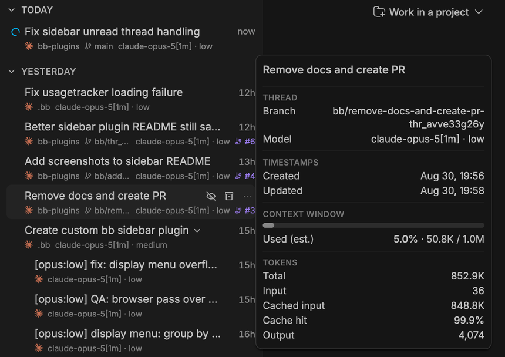
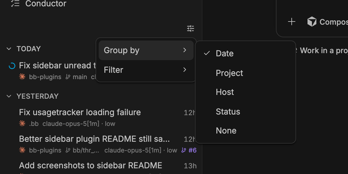

# bb plugin — Better Sidebar

A replacement for bb's sidebar thread list, mounted through
`app.slots.experimental_threadList`. A row leads with its status, carries a
second metadata line, and reveals its actions on hover — so a thread's project,
branch, model and state read without opening it.



## What it adds

- **Grouped sections** — threads group by date, project, host, status, or not at
  all. Each header collapses on click and draws its label alone.
- **A second metadata row** — the provider mark, the project name, the git
  branch, and the model and effort the thread runs on, under the title. The
  machine is named only when the thread runs somewhere other than this one:
  on your own machine it is the same word on every row.
- **Status leads the row** — the state glyph sits in the row's leading column,
  where the eye lands, and the provider mark sits on the metadata line below
  it. Each line's marks are sized against that line's text.
- **Hover actions** — mark read or unread, archive, and an overflow menu
  appear where the time sits, taking its place rather than covering the title.
- **A relative time per row** — when the thread last did anything, read from
  its newest event. bb's `updatedAt` is a record write that lags a running
  agent and moves for every thread at once on a bulk write.
- **Status glyphs** — five row states (needs you, working, planning, draft,
  idle) plus unread, each with one glyph. Extra signals — an error, a warning, a
  paused thread, a token budget ring — sit in the row's signal cluster.
- **A pull request chip** — the PR number for a thread whose branch has one,
  linking to the pull request.
- **A hover dossier** — resting on a row opens a card with the full branch,
  model and effort, created and updated timestamps in your own timezone, the
  context window as a percentage, and token counts abbreviated with the share
  of input served from cache. A field with no data is omitted, never zeroed.
- **Child threads, collapsed by default** — a thread that spawned subagents
  keeps them behind its chevron. Expanded, each child draws its own metadata
  line carrying the model it was spawned on, which is the one fact its
  parent's row cannot tell you.

## Display menu

The slider button above the list sets grouping and a project filter. Grouping
persists per device, in `localStorage`, and overrides the `groupBy` setting from
the moment you pick one. The project filter is session state: it survives no
reload.



## Install

```sh
bb plugin install git:https://github.com/Mokson/bb-plugins --subdirectory plugins/better-sidebar --yes
```

The list replaces bb's own as soon as the plugin loads. Uninstall it to get
bb's list back.

## Settings

Open **Settings → Extensions → Plugins → Better Sidebar**.

| Setting | Default | What it does |
| --- | --- | --- |
| `groupBy` | `date` | Default section grouping: `date`, `project`, `host`, `status`, `none`. A device that picked a grouping in the display menu ignores this. |
| `density` | `default` | Row height: `compact`, `default`, `detailed`. |
| `showPrChip` | on | Draws the pull request chip on rows whose branch has a PR. |
| `showProviderGlyph` | on | Draws the provider mark. |
| `showRelativeTime` | on | Shows `2h` instead of an absolute timestamp. |
| `showArchivedChildren` | on | Keeps archived child threads under their parent. |
| `showHeaderChip` | on | Shows the child thread count chip on a parent row. |
| `showSecondRow` | on | Hard off-switch for the metadata row. With it on, `density` and the grouping mode still decide. |
| `showProjectName` | on | Draws the project name on the metadata row. |
| `showBranch` | on | Draws the git branch on the metadata row. |
| `showModel` | on | Draws the model and effort. The only field on the row that costs a backend lookup: off, the list requests no execution options at all. |

An unset setting, a value of the wrong type, or an unrecognised enum member
falls back to the default, so a settings key this version does not read cannot
break the list.

## Develop

```sh
npm install
npm run typecheck
npm test
npm run build
bb plugin install . --yes
bb plugin dev
```
