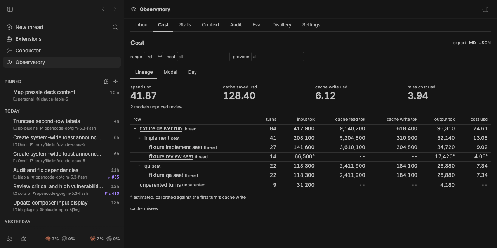
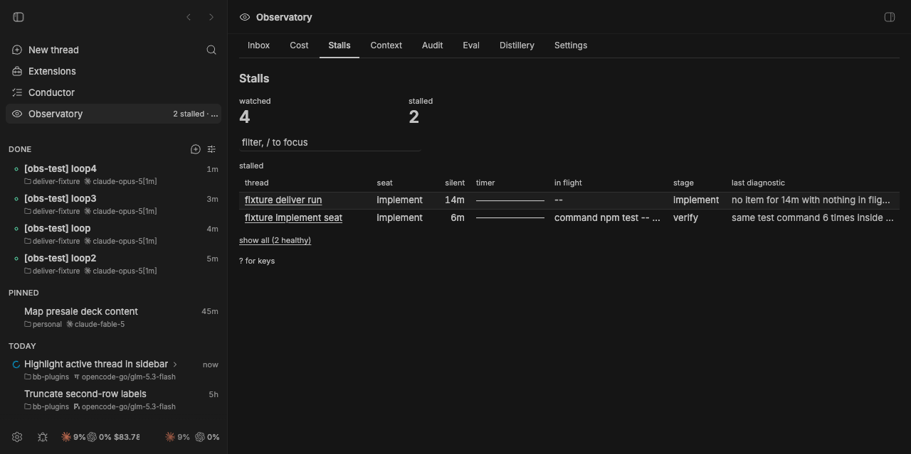
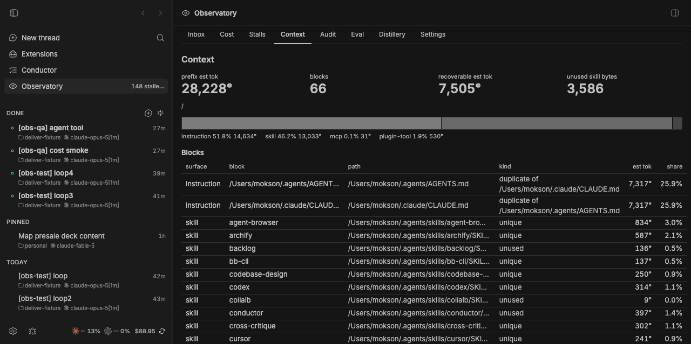
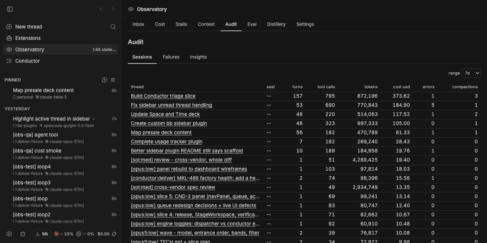
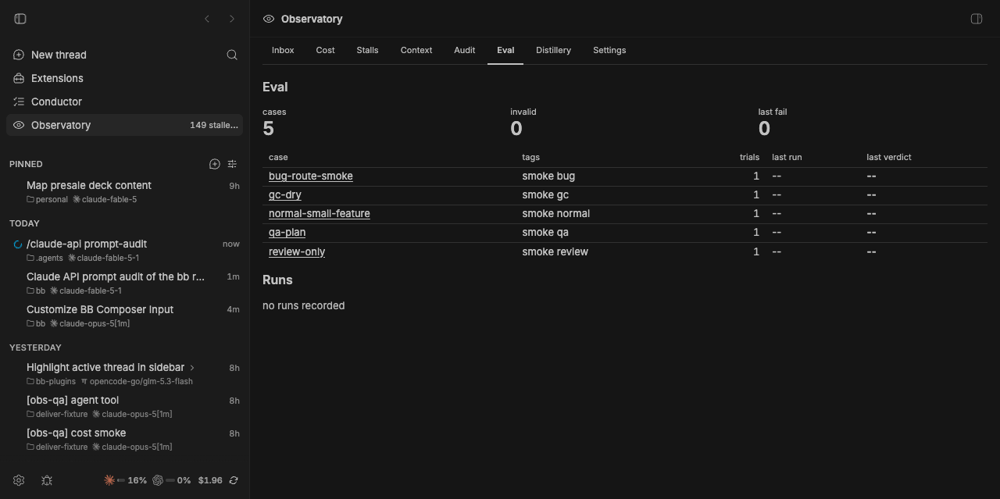
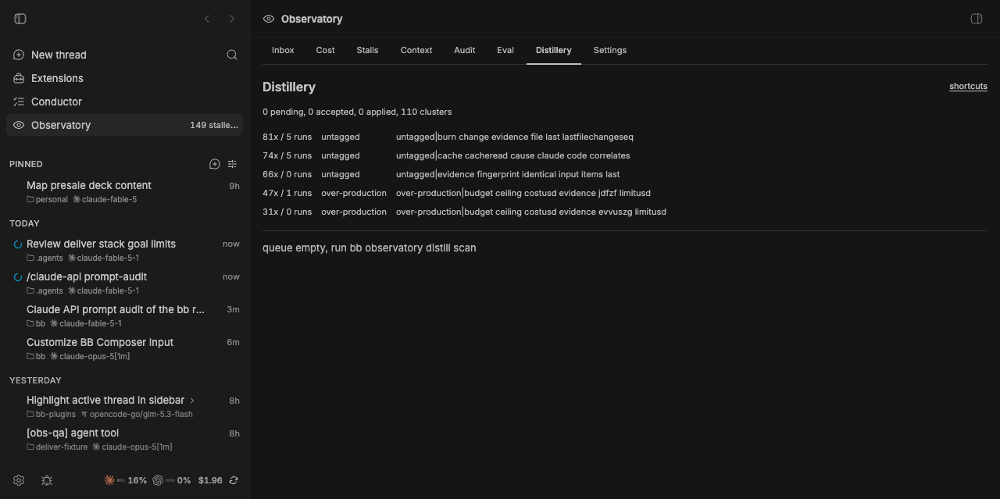

# bb plugin - Observatory

Cost, cache, stall, context, audit, eval and distillery for bb agent runs. One
ingestion core normalises bb thread, turn and item events into a per-turn
ledger, joins each turn to the provider session log on disk, and serves seven
read-mostly modules over it - in the panel, on the CLI, and as agent tools. The
plugin observes and advises: it never stops, kills, cancels, or archives a
thread it did not spawn. It absorbs the `usage-tracker` sidebar footer strip.



## Modules

- **core** - normalises bb thread, turn and item events into one ledger and
  joins them to the provider session logs on disk.
- **spend** - cost and cache accounting, cache-miss classification, and the
  `COST.md` the deliver stack consumes.
- **watch** - stall rules, an agent-tree budget, and a steer ladder that
  records every action before it sends one. It never stops a thread.
- **context** - instruction, skill and MCP composition audit with a token
  estimate calibrated against the first turn's cache write.
- **audit** - session metrics, verification detection, a failure ledger, and
  the audit pack the `harness-audit` skill reads.
- **eval** - regression cases for the deliver skill stack, run as hidden
  threads on a fixture repo against pinned baselines.
- **distillery** - mines corrections out of run ledgers into reviewable
  improvement drafts. It writes drafts, never skills.

Each module toggles independently and sits behind a breaker: five consecutive
failures trip it, it reports through `bb.status.needsConfiguration`, and core
ingestion carries on. Core itself never trips.

## Install

```sh
bb plugin install git:https://github.com/Mokson/bb-plugins \
  --subdirectory plugins/observatory
```

Then `bb observatory status` and `bb observatory doctor`.

## CLI

```
Usage: bb observatory <command>

  status     Module states, breaker counts, store counts, settings
  doctor     Database, migrations, and provider log roots
  coverage   Turn split coverage: log-exact, log-window, sidechain, n/a
  index      Run log index passes now: [--budget-mb N] [--passes N]
  backfill   Drain history and re-join it: --since <ISO|Nd> [--provider p]
             --reset  re-read every event; rebuilds derived rows, never
                      touches provider logs
  cost       Priced rollups: --range 1d|7d|30d|90d --group lineage|model|day
             --tree <threadId>  per-turn split for one thread
             --run <folder>     only threads attributed to that run folder
             --json             the rpc object, unformatted
  cost-md    Write COST.md for a run folder: cost-md <runFolder>
             [--snapshot final|mid-run] [--stdout]
  cache-misses  Prefix drops and their cause: [--range 7d] [--thread <id>]
  watch      Stall state per active thread: [--follow] [--json]
             explain <threadId>   signals and actions for one thread
             off|observe|steer    set the watch mode (stored in kv)
             steer <threadId> [--note <text>]     steer one thread by hand
             escalate <threadId> [--note <text>]  steer its parent instead
  context    Prompt-prefix composition: [surfaces] [--cwd path]
             [--thread <id>]  one thread's compaction estimate
             [--json]
  audit      One session against the 7d median: audit <threadId|runFolder>
             with no target, the sessions list: [--range 7d]
             [--json] [--export]
  failures   Failure signatures by count: [--range 7d] [--include-muted]
  insights   Cost drivers, models and failure signatures: [--range 7d]
  eval       Deliver-stack regression cases: eval <list|validate|show|run>
             run --dry-run [--tag t] [--case n] [--keep]  provisions and
                      prints the plan; spawns nothing
  distill    Recurring delivery failures, mined into reviewable harness fixes:
             scan [--run <folder>]  mine every signal source
             list [--state <s>]     the review queue
             show <id>              one draft with its evidence
             accept|reject|apply <id>
             edit <id> --file <json>
             draft                  spawn one hidden drafting batch (spends)
```

## Panel

Open **Observatory** in the nav. Pages are addressed under `observatory/`.

| Route | Page |
| --- | --- |
| `` | Inbox: what needs you now, across every module |
| `cost` | Cost overview, cache drilldown, per-thread cost |
| `stalls` | Watch: stall state per active thread, plus the trajectory view |
| `context` | Prompt-prefix composition, duplicates, dead skills |
| `audit` | `audit/sessions`, `audit/failures`, `audit/insights` |
| `eval` | Eval runs and cases |
| `distillery` | The draft review queue |
| `settings` | Watch mode, rule toggles, thresholds |











## Agent tools

Registered on threads whose project id is listed in `agents_optInProjects`.

| Tool | What it returns |
| --- | --- |
| `observatory_cost` | Cost, tokens and cache split for a bb thread, its subtree, or a deliver run folder. Compact JSON. |
| `observatory_trajectory` | Per-turn trajectory of a thread with OSCILLATION, LOOP and CONTEXT RESET markers plus waste attribution. |
| `observatory_context` | What this project's prompt prefix is made of: instructions, skills, MCP servers and plugin tools, with duplicates and dead skills. Optionally one thread's compaction estimate. |
| `observatory_audit_pack` | Session metrics against the 7-day median, verification coverage, unverified edits, failures and insight facets. On a run folder it also writes `audit.json`, `audit.md` and `COST.md` there and returns their paths. |
| `observatory_failures` | Top failure signatures across recent threads, with counts and when each was last seen. |
| `distillery_status` | Counts and top clusters from the distillery: how many recurring delivery failures are queued as drafts, and which signatures recur most. Signatures and counts only, no evidence text. |

## Settings

Open **Settings → Extensions → Plugins → Observatory**.

### Modules

| Setting | Default | What it does |
| --- | --- | --- |
| `modules_core` … `modules_distillery` | on | One toggle per module: `core`, `spend`, `watch`, `context`, `audit`, `eval`, `distillery`. Takes effect on `bb plugin reload observatory`. |

### Ingestion and retention

| Setting | Default | What it does |
| --- | --- | --- |
| `roots_extra` | empty | Comma-separated absolute paths scanned beside the defaults. |
| `index_budgetMb` | `256` | Upper bound on log bytes parsed in one five-minute pass. Unchanged files cost nothing, so this is only spent on new content. |
| `pricing_refreshHours` | `24` | How often the pricing snapshot refreshes. |
| `retention_itemsDays` | `30` | Days of item rows kept. |
| `retention_logTurnsDays` | `90` | Days of parsed log-turn rows kept. |
| `retention_turnsDays` | `365` | Days of turn rows kept. |

Default log roots, checked by `doctor`: `~/.claude/projects` (claude-code),
`~/.codex/sessions` (codex), `~/.pi/agent/sessions` (pi),
`~/.cursor/acp-sessions` (acp-cursor), `~/.omp/agent/sessions` (acp-omp).

### Spend and budgets

| Setting | Default | What it does |
| --- | --- | --- |
| `spend_cacheTtlMinutes` | module default | An idle gap longer than this expires the cached prefix, which is how a cache miss is classified idle-expiry. |
| `budget_perTreeUsd` | `50` | Budget for one thread tree, in USD. Feeds the `tree-budget` watch rule. |
| `budget_perDayUsd` | `500` | Budget per day, in USD. |

### Watch

| Setting | Default | What it does |
| --- | --- | --- |
| `watch_mode` | `observe` | `off` records nothing, `observe` records signals only, `steer` also sends steering messages. A KV override set from the panel outranks this and applies without a reload. |
| one toggle per rule | on | `silence-no-inflight`, `repeated-identical-tool`, `read-edit-read`, `active-no-turn`, `burn-no-change`, `retry-storm`, `tree-budget`. |
| `watch_silenceMinutes` | `4` | Silence with nothing in flight, in minutes. |
| `watch_repeatCount` | `3` | Identical tool calls in the last 20 items. |
| `watch_oscillationCycles` | `2` | Read/edit/read cycles on one path. |
| `watch_activeNoTurnMinutes` | `10` | Active with no turn started, in minutes. |
| `watch_burnTokens` | `150000` | Tokens burned since the last file change. |
| `watch_retryCount` | `3` | Retrying provider errors within 10 minutes. |
| premise reminder | off | After a compaction, queue one message listing the run ledger's done-when rows and open decisions. Needs watch mode `steer`. |
| quiet hours | `22-07` | Local-time window that suppresses notifications, `22-07` style. Signals are still recorded. Empty disables it. |

### Eval and distillery

| Setting | Default | What it does |
| --- | --- | --- |
| `eval_casesDir` | `~/.agents/eval/cases` | Where the regression cases live. |
| `eval_fixturesDir` | `~/fixtures` | Fixture repos the cases run against. |
| distillery provider | module default | Provider for the hidden drafting thread. Pinned rather than inherited so a draft's cost and behaviour do not drift with the UI's current provider. |
| distillery model | module default | Model for the drafting thread. |
| distillery effort | module default | `none`, `low`, `medium`, `high`. Drafting is structured extraction over evidence already assembled, not a reasoning task. |
| append findings | off | When on, `apply` also appends a `proposed` row to the target repo's `.agents/retro/FINDINGS.md`, and only when that repo is on its default branch. |
| `distillery_improvementsDir` | `~/.agents/improvements` | Where `apply` writes. It never writes under `~/.agents/skills`. |
| `distillery_monthlyBudgetUsd` | `10` | Ceiling on drafting spend per month. |

### Footer strip

| Setting | Default | What it does |
| --- | --- | --- |
| `usage_enableClaudeCode` | on | Show Claude Code usage in the sidebar footer. |
| `usage_enableCodex` | on | Show Codex usage in the sidebar footer. |
| `usage_compactLimit` | `Weekly` | Which limit the compact percentage and bar show. |

### Agent tools

| Setting | Default | What it does |
| --- | --- | --- |
| `agents_optInProjects` | empty | Comma-separated project ids whose threads receive the Observatory tool instructions. |

## Known gaps

- **acp-cursor turns are unavailable.** Its parser is presence-only: it proves a
  session file exists but yields no per-turn rows, so those turns carry
  `split_source = unavailable` and every surface renders `n/a`, never a guess.
- **The host filter has no backing column.** The ledger records no host, so
  filtering by machine is inert until one is added.
- **Migrations replay on every boot.** They are idempotent by design, so this is
  correct rather than wrong, but boot cost grows with the migration list.
- **The install slot is global.** One Observatory build serves the whole bb
  install, so two worktrees installing over each other overwrite one another.
  `bb observatory status` prints `installed <path>` for exactly this reason.
- **The distillery transcript detector is structural only.** bb items carry no
  text, so a transcript is recognised by item shape, never by what it says.
- **Two steer rules are disabled.** Precision measured 0/15 on both candidates
  (`docs/specs/OBS-1_observatory/evidence/watch-steer/PRECISION.md`); they stay
  off pending a re-measurement.

## Develop

```sh
npm install
npm run typecheck
npm test
npm run build
bb plugin install . --yes
bb plugin dev
```
