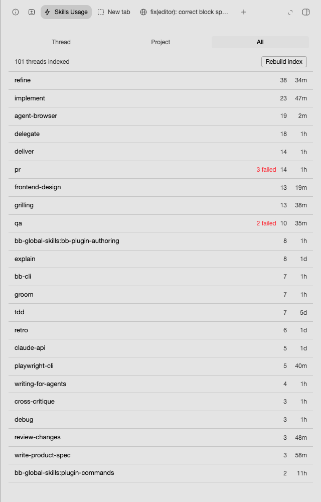

# skill-usage

Which skills a BB thread actually invoked, in the thread right panel, with
project-wide and global rollups.


## What it shows

A segmented switcher over three scopes.

**Thread** lists every `Skill` tool call in the open thread, in invocation
order, with a status dot and the time. A row expands in place to show the
arguments, the terminal status, and the result string. Thread scope reads
thread events directly, so it is never a refresh behind, and it stays live
through a server-held wait: a skill appears as the agent invokes it.

**Project** and **All** list one row per skill with its total, its failure
count, and how long ago it was last used. Expanding a row names the threads
that used the skill; clicking a thread navigates there.



## What counts as a used skill

Two sources, merged in time order.

**Tool calls** come from the BB thread event stream: `item_kind` `toolCall`,
`data.item.tool` `Skill`. The `item/started` and `item/completed` rows are
collapsed into one invocation, so the list shows invocations, not events.
Failures, such as `Unknown skill: qa`, are flagged rather than hidden.

**Slash commands** such as `/pr` come from the Claude Code session log, and
render with a leading `/`. They leave no BB event at all, so the log is the
only place they survive. The log entry pairs `<command-name>/pr</command-name>`
with the entry after it, which carries
`Base directory for this skill: <path>`. That pairing is what separates a
skill-backed command from a built-in such as `/clear`, which loads no skill
and is not listed.

Logs are found under `$CLAUDE_CONFIG_DIR/projects` (default `~/.claude`), by
the provider session ids BB records for the thread. A thread whose log is not
on this machine - another provider, or a remote host - shows its tool calls
only.

## The rollup index

The BB SDK has no cross-thread event query: `threads.events.list` takes one
`threadId`. A project or global rollup would therefore re-walk every thread on
every open, so this plugin keeps its own sqlite index at
`<dataDir>/plugins/skill-usage/data.db`.

- Rows hold facts only. Thread titles resolve live, so a rename never rewrites
  the index.
- Each thread carries an event-sequence cursor, so a pass only reads what is
  new.
- Refresh happens when you open a rollup scope. There is no cron and no
  background service.
- The first open backfills across every thread and reports progress as it
  goes; the list fills in rather than appearing whole at the end.
- Archived and hidden threads count. Threads that no longer exist are pruned
  on each pass, so totals only ever describe threads you can still open.
- **Rebuild index** drops the table and cursors and runs a full pass again.

## Known limits

Slash commands are only visible for threads whose Claude Code session log is
readable on this machine.

You cannot jump from a listed invocation to its place in the transcript. The
Plugin SDK exposes no API to scroll, focus, highlight, or deep-link a
transcript event: `useBbNavigate` targets threads, projects, panels and files,
and `ThreadChat` documents its internal timeline rows as deliberately not
exposed. Rows therefore expand in place instead.

Global counts depend on an index that refreshes only when you open a rollup,
so a run you never follow with a rollup open is not counted until you do.

## Development

```sh
cd plugins/skill-usage
npm install
npm run check     # typecheck, tests, build
```

`better-sqlite3` needs its native binding for the index tests; it is approved
in `allowScripts`. Use `env -u BB_CLI bb plugin build .` inside a BB thread so
the build uses the plugin's pinned toolchain.
